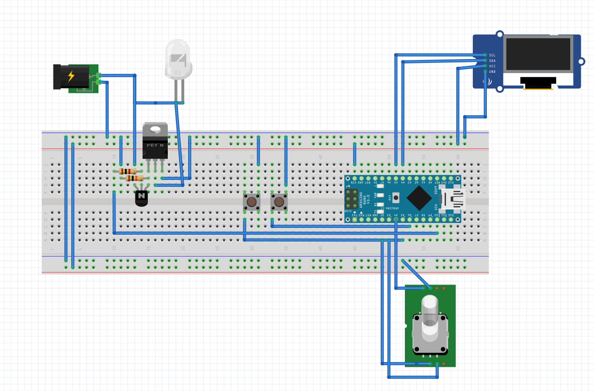
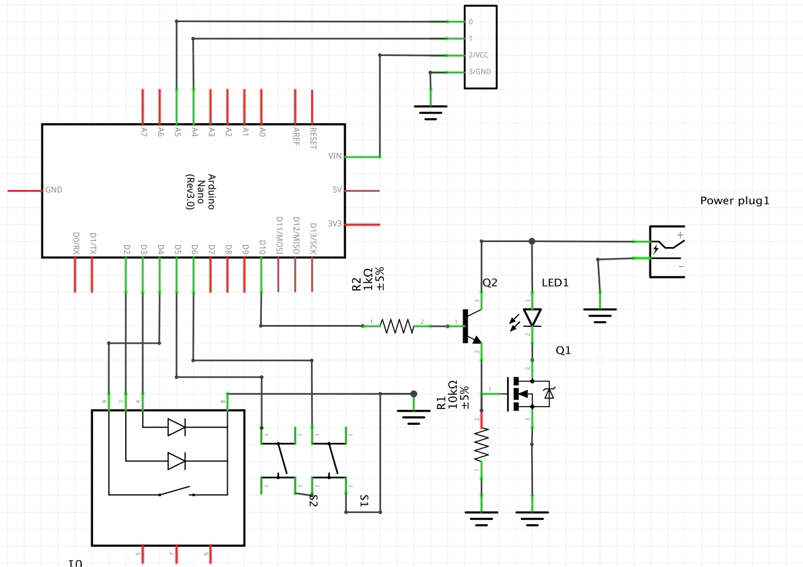

= Project specifications

* This project is a simple basic stroboscope using arduino and power LED's in its simplest form.
* The project can flash the power LED with frequencies from 1Hz to 50Khz. Duty cycle is fixed in the code.
* The stroboscope is fed by a 3 Cell 11.2v Lipo battery.
* The last used frequency is stored in EEPROM and will be restored with the device is turned on.

= Controls
* On/Off switch: cuts the main power when off
* Rotary switch push button: When the system starts, the cursor is on the most significant digit. Each pushing of push button, will move cursor to right. The cursor will roll to the most significant when it reaches the least significant digit.
* Rotary switch: Turning the rotary switch to right or left will increase and decrease the digit at the cursor respectively.
* Double push button: Pressing it doubles the frequency
* Half push button: pressin it halves the frequency

= Parts list
* https://store.arduino.cc/usa/arduino-nano[Arduino nano]
* https://www.infineon.com/cms/en/product/power/mosfet/20v-300v-n-channel-power-mosfet/80v-100v-n-channel-power-mosfet/irf540n/[IRF540N Mosfet]
* https://en.wikipedia.org/wiki/2N2222[2N2222 generic NPN transistor]
* 1K resisor
* 10K resistor
* http://www.ebay.de/itm/262467105661[10W power LED]
* LED heatsink
* https://www.ebay.com/itm/2-x-ALPS-EC11-Rotary-Encoder-30-Pulses-20mm-Shaft-PC-Mount-with-Push-on-Switch/252360818672?epid=1863404209&hash=item3ac1e07ff0:g:Y2AAAOSwp5JWXZQv[Rotary swtich with PushButton]
* On/Off switch
* 3Cell Lipo Battery
* https://www.ebay.de/itm/Hot-Sale-BLACK-PLASTIC-ELECTRONICS-PROJECT-BOX-ENCLOSURE-CASE-100x60x25-mm-CJ/112557747586?ssPageName=STRK%3AMEBIDX%3AIT&var=412955226802&_trksid=p2057872.m2749.l2649[Plastic project box 10*6*25 mm]

= Hardware design
The schematic and breadboard diagram can be found in sketch.fzz using http://fritzing.org/home/[Fritzing] free tool.
10W LED needs around 11v. The current should be limitted to 1A on steady usage but can more current, maybe up to 10 A on very short bursts. If the 11.2 battery is directy connected to LED on steady state, there is a high chance of LED to burn. But as we only connect the battery to LED terminaln only in short bursts, it should be no problem.
A MOSFET is used to drive the current. In the test arduino could not provide enouph voltage for Mosfet to turn on. To increase the voltage a generic 2n2222 is used.
The pulse whichd drives the 2N2222 and Mosfet is generated accurately by Arduino.

= Arduino Stroboscope

== libraries used
http://www.mathertel.de/Arduino/RotaryEncoderLibrary.aspx (Rotary library)
https://github.com/adafruit/Adafruit_SSD1306 (SSD1306 library)
https://github.com/adafruit/Adafruit-GFX-Library (GFX library)

* I used this guide for driving OLED: http://www.instructables.com/id/Monochrome-096-i2c-OLED-display-with-arduino-SSD13/

= Schematics

Here is the breadboard diagram:

and this is the schematics diagram:

